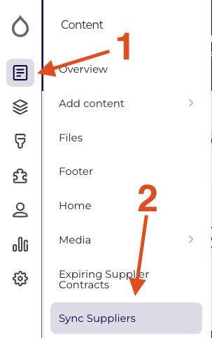

# Supplier Data Syncing

---

**Updated Date:** REDACTED

**Covers:**

- Overview of how data is synced between the site and the CLIENT Data Vault
- Daily Import functionality and formatting
- Daily Export functionality and formatting
- Manually syncing suppliers
- Connecting to the Web App via SFTP

---

## Overview

Supplier data is synced between the Supplier Search web app and the CLIENT Data Vault.  A subset of a supplier’s properties are “owned” by the Data Vault, i.e. the Data Vault is the source of record. A subset of supplier properties are “owned” by the web app, these values are generated and managed from the web app only.

Once daily, two scheduled actions are taken:

1. At **3am ET**, all supplier data is exported to a CSV in the web app’s private files directory. This CSV contains nearly all data for each supplier.
2. At **4am ET**, supplier data is imported from a CSV into the web app. This CSV is supplied by CLIENT and is expected to contain data for all suppliers that should appear in the app.

## The Daily Import

CLIENT will upload a CSV to the specified directory (see [Connecting to the Web App via SFTP](#connecting-to-the-web-app-via-sftp)). The CSV file must be named `CLIENT_suppliers.csv`. If a previously imported supplier is missing from the new CSV, the supplier will remain in the web app in an archived state, i.e. it will be invisible to anyone but administrators. Should the removed supplier be re-added to a future CSV (with the same supplier_id), the existing supplier will be re-published on the web app, preserving any previously entered web-app-only data.

### Expected CSV Format

General CSV formatting:

**Delimiter:** `,` (comma)

**Enclosure:** `"` (double quote)

**Terminator:** `\n` (newline)

Additionally, the CSV is expected to have each of the following columns, with data formatted as noted. The first row of the CSV must contain the column names, exactly as written below.

**`supplier_id`** (string): The unique ID for this supplier, e.g. `123456789`

**`name`** (string): The supplier’s name, e.g. `Redfin Solutions`

We do our best to titlecase this name before importing to the web app. However, the script is not sophisticated enough to handle all cases.

**`address`** (string): The supplier’s street address, e.g. `123 Abc Street`

We do our best to titlecase this name before importing to the web app. However, the script is not sophisticated enough to handle all cases.

**`city`** (string): The supplier’s city, e.g `Cambridge`

We do our best to titlecase this name before importing to the web app. However, the script is not sophisticated enough to handle all cases.

**`state`** (two letter state code): The supplier’s two letter state code, e.g. `MA`

**`zip_code`** (string): The supplier’s zip code, e.g. `12345` or `12345-7890`

**`country`** (two letter country code): The supplier’s two letter country code, e.g. `US`

**`latitude`** (string): A valid latitude value, e.g. `43.86228`

**`longitude`** (string): A valid longitude value, e.g. `70.04944`

**`supplier_website`** (URL): A website URL, e.g. `https://example.com`

Drupal does not allow URLs without a defined scheme, i.e. `example.com` is invalid and will cause an error. As a simple solution, we check that the URL here begins with `http` and if it does not, we prepend the URL with `https://`, e.g. `example.com` will be converted to `https://example.com`

**`diversity_attributes`** (pipe-delimited list of strings): The full list of a supplier’s diversity attributes.

Each attribute in the source is assumed to be a composite attribute that is to be converted to one or more diversity attributes as viewed on the site. Administrators can manage diversity attributes and their conversions in the web app’s UI (see Managing Diversity Certs (link redacted)). Because of this assumption, that all source attributes need to be converted, if no conversion is defined in the web app, the attributes will not be added to the supplier.

**`word_search`** (pipe-delimited list of strings): The full list of commodities for the supplier.

We do limited sanitization of commodities, but otherwise commodities are imported exactly as they appear in the source CSV.

1. We convert the commodity to all lowercase.

2. We check that there are no duplicates in the list for a single supplier.

3. We check that the commodity is not on the banned list (see Managing Commodities (link redacted)).

## The Daily Export

The web app will generate a CSV in the specified directory (see [Connecting to the Web App](#connecting-to-the-web-app-via-sftp)). The CSV will be generated with a date string in its name, i.e. `web_suppliers__YYYYMMDD.csv`, e.g. `web_suppliers__20220615.csv`. This export contains nearly all data from all published (visible) suppliers in the web app. I.e. if a supplier is removed from the import CSV and consequentially unpublished (made invisible to non-admins) in the web app, that supplier will then stop appearing in the export, until it’s added back to the import CSV and re-published.

### CSV Format

General CSV formatting:

**Delimiter:** `,` (comma)

**Enclosure:** `"` (double quote)

**Terminator:** `\n` (newline)

**`datavault_id`** (string): This is the `supplier_id` from the import.

**`drupal_id`** (string): The supplier’s Drupal node ID, i.e. the ID of the supplier in the web app.

**`updated`** (HTML datetime): A date string, i.e. **`Y-m-d\TH:i:sO`**, e.g. `2022-06-15T13:14:13+0000`, this date is updated ONLY when the supplier is updated through the web app, via the UI.

**`name`** (string): The supplier’s name.

**`image`** (URL): A URL to the supplier’s image hosted by the web app.

**`social_links`** (pipe-delimited list of social links): Social links are formatted like: `TYPE,URL`, e.g. `Facebook,https://www.facebook.com/example`. Multiple social links are separated by a pipe (`|`)

**`tier`** (string): The supplier tier, e.g. `CLIENT Preferred Supplier` or `CLIENT Internal Supplier`

**`preferred_contract_start`** (HTML datetime): A date string, i.e. **`Y-m-d\TH:i:sO`**, e.g. `2022-06-15T13:14:13+0000` when the supplier’s “preferred” contract started

**`preferred_contract_end`** (HTML datetime): A date string, i.e. **`Y-m-d\TH:i:sO`**, e.g. `2022-06-15T13:14:13+0000` when the supplier’s “preferred” contract expires or expired.

**`ss_contact`** (string): The Strategic Sourcing staff member that manages the contract with the preferred supplier.

**`commodities_type`** (string): `custom` if supplier is overriding the supplier’s commodities in the web app, `synced` if the supplier is using commodities as synced from the data vault.

**`commodities`** (pipe-delimited list of strings): The list of commodity names the supplier is *using*, i.e. the custom commodities if commodities_type = custom, otherwise the sanitized, synced commodities.

**`diversity_certs`** (pipe-delimited list of strings): The full list of the supplier’s diversity certs. Note: these are the transformed diversity certs as used on the web app, not the composite certs in the original CSV.

**`address_street`** (string): The supplier’s street address, e.g. `123 Abc Street`

**`address_street2`** (string): The supplier’s street address, second line e.g. `Building X, Unit Y`

**`address_city`** (string): The supplier’s city, e.g `Cambridge`

**`address_state`** (two letter state code): The supplier’s two letter state code, e.g. `MA`

**`address_country`** (two letter country code): The supplier’s two letter country code, e.g. `US`

**`address_postal_code`** (string): The supplier’s zip code, e.g. `12345` or `12345-7890`

**`latitude`** (string): A valid latitude value, e.g. `43.86228`

**`longitude`** (string): A valid longitude value, e.g. `70.04944`

**`contact_name`** (string): The supplier contact’s name.

**`contact_email`** (string): The supplier contact’s email address.

**`contact_number`** (string): The supplier’s contact phone number.

**`contract_url`** (string): The supplier’s contact URL.

**`buy2pay_url`** (string): The supplier’s “Buy to Pay” URL.

**`concur_url`** (string): The supplier’s “Concur” URL.

## Manually Syncing Suppliers

A “Supplier Sync” form exists where administrators can trigger the supplier import process. This form uses the same source file as the daily import. This process is very slow so it’s only recommended to use this manual process in extreme circumstances.

Access the form via the administration menu: Content -> Sync Suppliers

Navigate to the Supplier Sync form via Content menu of the administration menu.

## Connecting to the Web App via SFTP

Connecting is nearly identical for all environments, only the host and user change.

**Host:**

Live: `REDACTED`

Test: `REDACTED`

Dev: `REDACTED`

**User:**

Live: `REDACTED`

Test: `REDACTED`

Dev: `REDACTED`

**Port:** `REDACTED`

**Pass:** Use the SSH key pair shared with your team

**Directory:** `/files/private/import-export`

